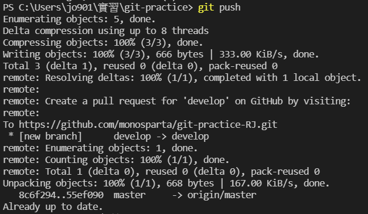
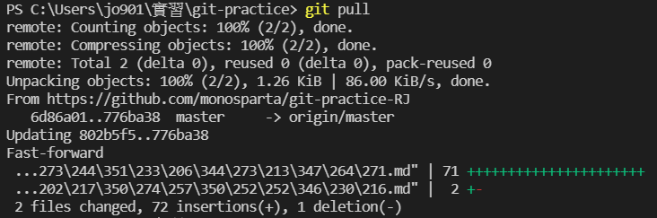

# GitHub使用方法
當所有變更Commit到本地儲存庫後，接下來就可以Push到GitHub上了，不過要先有一個GitHub帳號，然後建立一個遠端儲存庫。
## 一開始要設定本地儲存庫對應到的遠端儲存庫網址
    $ git remote add origin <遠端儲存庫網址>
## 接下來進行首次Push
    $ git push -u origin master
## 第一次Push完成後，之後就不需要帶參數就能成功了，像這樣

## 做完Push之後就能在GitHub上看到自己的檔案
## Pull用來將遠端儲存庫的進度同步到本地儲存庫

## 這樣就完成同步囉